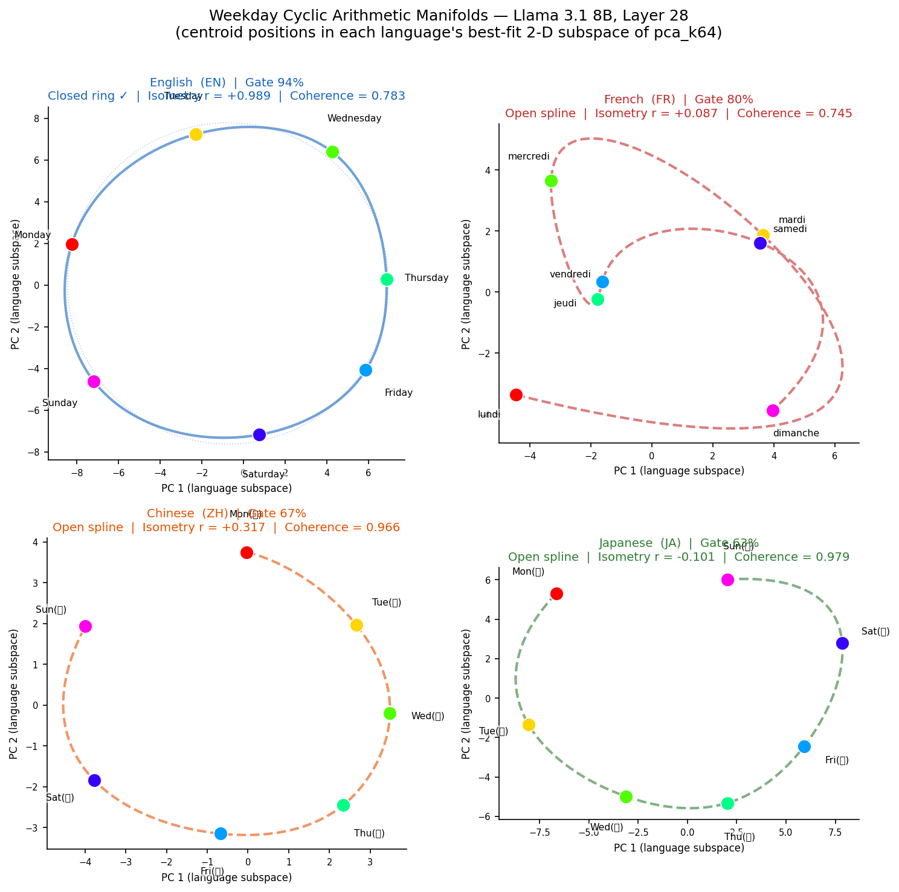
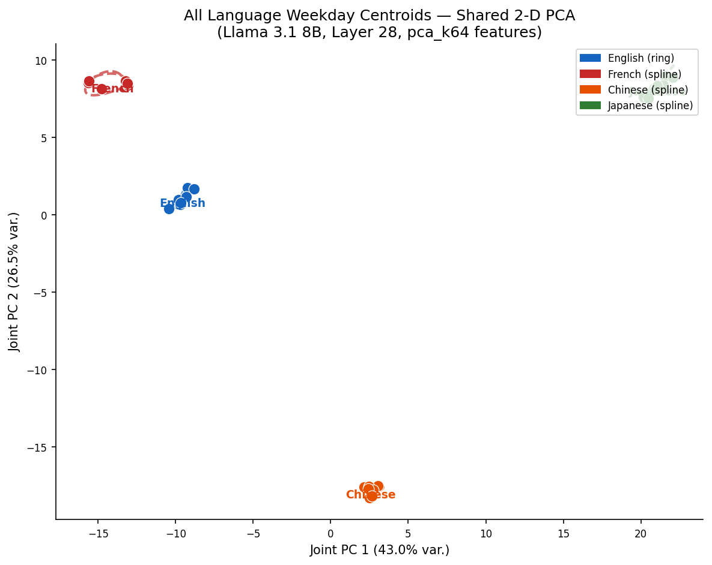
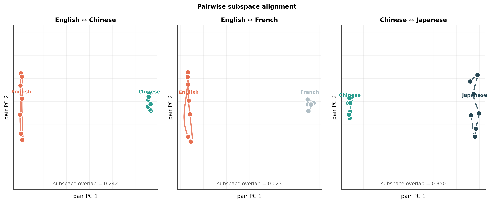
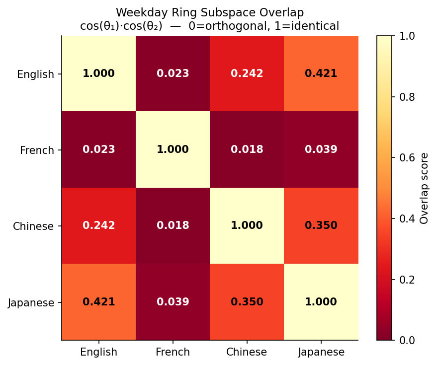
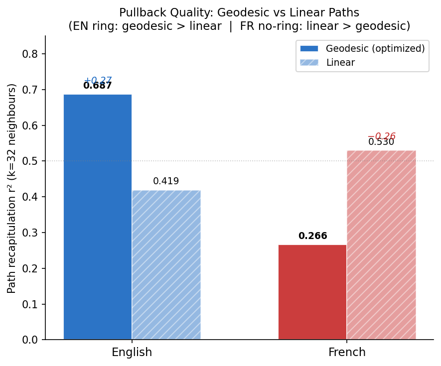
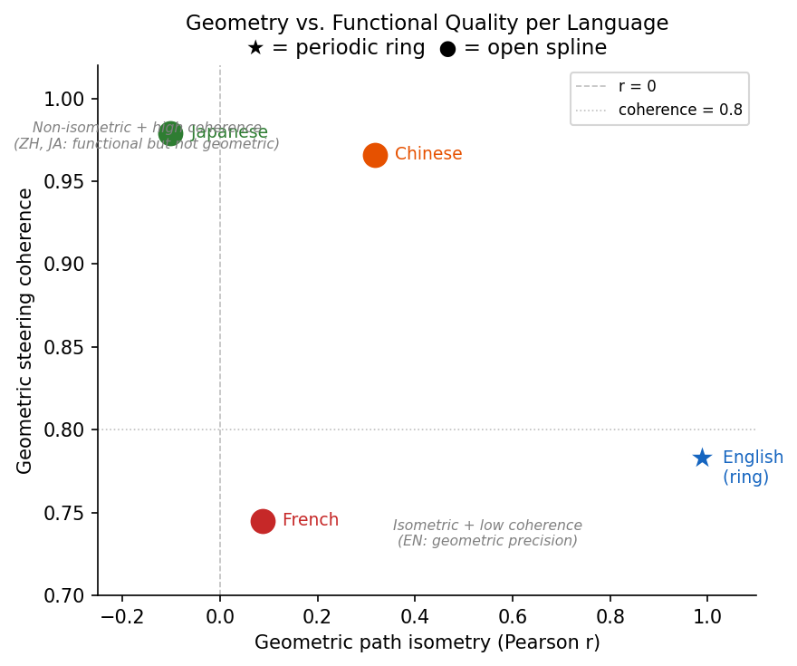
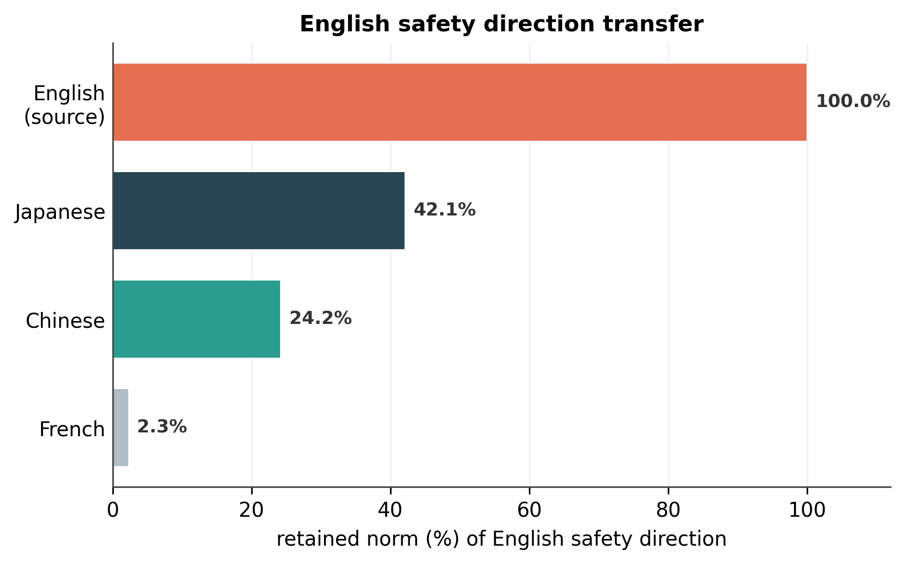
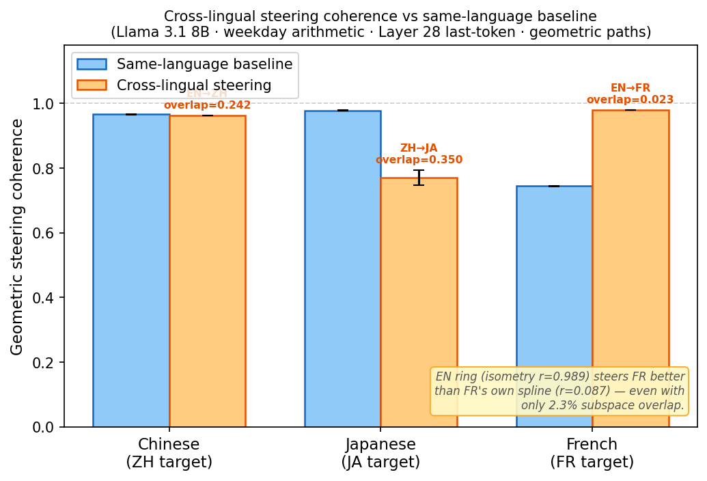

# Multilingual Concept Manifolds in Large Language Models
### A presentation-oriented walkthrough of the experiments, results, and their meaning for AI alignment

**Model studied:** Llama 3.1 8B (base) — with cross-model comparisons to Gemma 2 9B and Gemma 4 31B
**Core task:** weekday cyclic arithmetic ("What day is 3 days after Monday?") across six languages
**Where the analysis lives:** Layer 28 of 32, last-token position, 64-dimensional PCA subspace
**Figures referenced below:** `result/figures/fig1…fig8`

> **Revision note (2026-06-12, final).** This document has been updated now that the last pending
> experiments — the live cross-lingual *steering* runs (Cinaps jobs 12573–12575) — have completed.
> Their result was a genuine surprise that **reversed the central prediction of the earlier draft.** The
> Executive Summary, the new §III.8, Finding 5 in Part IV, and the whole of Part V have been rewritten
> to reflect it. The earlier static-geometry conclusion ("English interventions don't transfer") is now
> presented as a *hypothesis that the behavioral data refuted* — which turns out to be the most
> interesting result of the entire program.

> **Revision note (2026-06-16, Gemma-3-27B program).** The program was extended to **Gemma-3-27B base
> at Layer 54** across **11 languages** (sessions `lucid-heron`, `swift-tundra`, `vivid-marlin`). Two
> results from this extension revise claims below and are folded in as dated callouts (not yet rewritten
> into the Llama-primary narrative):
> 1. **The CJK/Hangul "broken geometry" was substantially a *measurement artifact*.** The belief manifold
>    was scored at a single free-generation step (`ol[-1]`), which for multi-token answers that share a
>    prefix/suffix (ZH 星期, KO 요일, JA 曜日) reads a non-discriminative position. Re-scoring with the model's
>    **teacher-forced likelihood of the full gold answer** lifts isometry: **KO `nan`→0.852, JA 0.081→0.527,
>    ZH −0.108→0.466**, EN/FR controls unchanged. JA's geodesic≪linear coherence gap *survives* (real kink).
>    *Strengthens the "shared geometry" story on isometry — see the Finding 5/Part VI updates and
>    `agent_logs/2026-06-15--belief-rescore-steering--vivid-marlin/result/REPORT.md`.*
> 2. **Finding 5's source-quality law does NOT generalize to reverse (X→EN) transfer on Gemma.** The very
>    reverse pairs Part VI flagged as decisive were run: a *clean* non-English source does **not** steer EN
>    better than a degenerate one (ko→EN=0.808 with KO the cleanest ring of all, ≈ overlap-matched zh→EN=0.793),
>    and subspace **overlap predicts transfer at least as well as source isometry** (Pearson 0.49 vs 0.52,
>    own-coherence −0.24). See the Finding 5 and Part VI updates.

---

## 0. How to read this document

This document is written so that a reader who has *never* heard of "manifold steering" can follow it
end to end. Every technical term is defined the first time it appears, and there is a glossary at the
end. The narrative is layered:

- **Part I** builds the conceptual vocabulary from scratch (what an "activation," a "manifold," a "ring,"
  and "steering" actually are).
- **Part II** describes the experiments and *why* each one was run.
- **Part III** presents the results with the plots.
- **Part IV** analyzes what the results mean taken together.
- **Part V** connects everything to AI alignment — this is the section we have invested the most in.
- **Part VI** is an honest accounting of what is now complete and what remains for future work.

If you only have two minutes, read the Executive Summary directly below.

---

## Executive Summary (the one-paragraph version)

Large language models appear to do certain kinds of reasoning *geometrically*: when Llama 3.1 8B answers
"what weekday comes N days after Monday?", the internal representations of the seven weekdays are arranged
in a smooth, low-dimensional shape — for English, a near-perfect **closed ring**, exactly the shape the
seven-day cycle "should" have. We asked whether this geometric encoding is universal across languages.
It is not. **English is the only language in which the model forms a genuine closed ring.** French,
Chinese, Japanese, and Hindi solve the same arithmetic (when they can) using open, less organized curves,
and — measured *statically* — **every language pair occupies an almost different region of the model's
internal space**: a "direction" extracted from English representations retains only ~2% of its strength
when projected onto French's subspace, and ~24% onto Chinese.

On the basis of that static geometry alone, the earlier draft of this report predicted that English-derived
interventions would *not* transfer to other languages. **The live steering experiments — the final piece of
the program, now complete — overturned that prediction.** When the clean English weekday ring is actually
*used* to steer French prompts, it produces the correct French day **98% of the time — better than French's
own internal manifold manages (74%)** — and it does so across that 2%-overlap, near-orthogonal subspace.
Across all three tested pairs, transfer success was **anti-correlated** with static subspace overlap and
instead tracked the **geometric quality (isometry) of the *source* manifold**: the clean English ring is a
superb steering tool for any language, while a mediocre source (Chinese, whose own manifold is a messy open
spline) transfers poorly even to its closest neighbor (Japanese), the pair with the *highest* overlap.

The alignment implication, developed in Part V, is therefore double-edged and more interesting than the
original pessimistic story: English-tuned interventions may transfer across languages **far more readily
than static geometry suggests** — encouraging for *deploying* a safety intervention, but alarming for the
symmetric possibility that an English-discovered *jailbreak* transfers just as well. The sharpest single
lesson is methodological: **static subspace geometry, on its own, is not a reliable predictor of
cross-lingual intervention transfer** — a confident offline prediction was decisively refuted by the online
behavioral test.

---

# Part I — Background: what is "manifold steering"?

## I.1 Activations and the residual stream

A transformer language model processes text by turning each token into a long list of numbers — a
**vector** — and repeatedly transforming it as the vector flows up through the model's layers. This
running vector is called the **residual stream**, and at any given layer and token position it is the
model's internal "state of mind" about the text so far. For Llama 3.1 8B this vector has ~4096 dimensions.

We call a snapshot of this vector an **activation**. The central bet of modern interpretability research
is that activations are not random noise: meaningful concepts correspond to structured, recoverable
patterns inside them. If that is true, we can *read* what the model is thinking, and potentially *edit* it.

## I.2 From a cloud of points to a manifold

Take a simple structured concept: the seven days of the week. They form a **cycle** — after Sunday you
wrap back to Monday. Now collect the model's activation vector for each weekday (averaged over many
prompts; this average is called a **centroid**). You get seven points sitting in that ~4096-dimensional
space.

A **manifold** is just a smooth, low-dimensional shape that a set of points lies on or near. The
hypothesis is that these seven weekday points don't scatter arbitrarily — they lie close to a simple 1D
curve. And because the underlying concept is *cyclic*, the most faithful possible curve is a **closed
ring**: a loop where Monday → Tuesday → … → Sunday → back to Monday. If the model has discovered the
cyclic structure of the week, its geometry should reflect it.

To actually see this shape, we compress the high-dimensional activations down to a handful of directions
using **PCA** (Principal Component Analysis — a standard method that finds the directions of greatest
variation). We keep a 64-dimensional PCA subspace and, for plotting, project further down to the best 2D
plane. **Figure 1** shows exactly this.

## I.3 The encoding gate — a prerequisite

Before asking *how* a model represents weekday arithmetic, we must check that it *can do it at all*.
The **encoding gate** is a simple screening test: present many (start-day, offset) questions and measure
how often the model's top answer is correct. We require **≥ 60% accuracy** to proceed. A language that
fails the gate can still be examined for internal geometry (sometimes the geometry is there even when the
output is wrong — see Part IV), but the gate tells us whether output and geometry are aligned.

## I.4 Steering: linear vs. geodesic

**Steering** means deliberately editing the residual stream to change the model's behavior — for example,
nudging its internal "Monday" state toward "Thursday" and checking that it now answers Thursday.

There are two ways to make that nudge:

- **Linear steering** moves in a straight line through activation space from the "Monday" point to the
  "Thursday" point. It is simple but naive: the straight line may cut *across* the ring, passing through
  empty regions of space that don't correspond to any real weekday — producing incoherent intermediate
  states.
- **Geodesic steering** moves *along* the curved manifold itself — following the ring around through
  Tuesday and Wednesday. "Geodesic" simply means "shortest path that stays on the surface" (like flying
  along the Earth's curve rather than tunneling through it). If the model genuinely encodes the concept on
  a curved manifold, geodesic steering should produce more coherent, on-concept transitions than the
  straight-line shortcut.

Comparing these two is one of the sharpest tests of whether a manifold is "real": **if following the
curve beats cutting the chord, the curvature is doing real computational work.**

## I.5 The five metrics we report (plain-language definitions)

| Metric | What it asks | Range / meaning |
|---|---|---|
| **Gate accuracy** | Can the model answer the arithmetic correctly? | % correct; ≥60% = pass |
| **Ring? (periodic)** | Does the fitted curve close into a loop? | Yes (closed ring) / No (open arc) |
| **Isometry r** | Do distances *along the internal curve* match the real day-offsets? | Pearson correlation; +1 = perfectly faithful, 0 = unrelated, −1 = inverted |
| **Coherence** | When we steer along the curve, does the model output the right day? | Probability 0–1; high = steerable |
| **Pullback r²** | How well does the model's *actual activation trajectory* during steering reproduce the curve? | 0–1; compared geodesic-vs-linear |
| **Subspace overlap** | Do two languages live in the same region of activation space? | cos(θ₁)·cos(θ₂), 0 = orthogonal, 1 = identical |

Two of these — **isometry** and **coherence** — measure *different* things and can disagree, which turns
out to be one of the most interesting findings (Part IV).

---

# Part II — The experiments and their purpose

## II.1 The task family

All experiments use one task — **cyclic weekday arithmetic** — instantiated in six languages, so that the
*concept* is held fixed while the *surface language* varies. This is the key experimental control: any
difference we see is about how the model represents the same idea across languages, not about different
ideas.

| Language | Example prompt | Gate role |
|---|---|---|
| English (EN) | "What day is 3 days after Monday?" | reference / baseline |
| French (FR) | "Quel jour est 3 jours après lundi?" | Latin-script comparison |
| Chinese (ZH) | "星期一后3天是哪天？" | CJK script |
| Japanese (JA) | "月曜日の3日後は何曜日ですか？" | CJK script |
| Hindi (HI) | "सोमवार के 3 दिन बाद कौन सा दिन होगा?" | Devanagari script (typologically distant) |
| Spanish (ES) | "¿Qué día es 3 días después de lunes?" | second Latin comparison |

(Parallel `months` variants with a 12-cycle were also run; they appear in the analysis of Part IV.)

## II.2 The analysis pipeline (what each stage is *for*)

Each language is pushed through a fixed sequence of analyses. Each stage answers one question:

1. **Encoding gate** — *Can the model do the task?* (screening)
2. **Subspace** — *Where in the residual stream does the concept live?* (find the layer + PCA subspace)
3. **Activation manifold** — *What shape do the seven weekday centroids form?* (fit a 1D spline; detect
   ring vs. open arc)
4. **Path steering** — *Is the shape causally real?* (steer along it; measure isometry + coherence)
5. **Pullback** — *Is the curvature genuine?* (optimize geodesic paths and compare to straight lines)

## II.3 The two new cross-lingual analyses (the heart of this session)

This session added two genuinely new analyses, built specifically to ask whether the *geometry itself*
is shared across languages:

- **`cross_lingual_manifold`** (offline) — takes two languages' weekday rings and measures the **principal
  angles** between the planes they occupy. Principal angles are the higher-dimensional generalization of
  "the angle between two lines": 0° means the two languages use the *same* internal plane, 90° means
  *perpendicular / unrelated* planes. From these we compute the **subspace overlap** score.
- **`cross_lingual_steering`** (online) — the live test: take the manifold learned from a *source* language
  (say English) and use it to steer prompts written in a *target* language (say Chinese). If the geometry
  is shared, English steering should still move Chinese outputs coherently. **This analysis is now complete
  (jobs 12573–12575), and its result is the headline finding of the whole program** — see §III.8 and
  Finding 5.

## II.4 Why this matters as a design choice

Most interpretability and safety work is done in English. If concept geometry were universal, an English
"refuse-harmful-requests" direction would work in every language for free. The entire point of varying
language while fixing the concept is to **test that assumption directly**. The answer (Part V) is that
the assumption is largely false.

---

# Part III — Results

## III.1 The encoding gate: who can even do the task?

| Language | Gate accuracy | Pass? |
|---|---|---|
| English (EN) | **93.9%** | ✓ |
| French (FR) | **79.6%** | ✓ |
| Chinese (ZH) | **67.3%** | ✓ |
| Japanese (JA) | **63.3%** | ✓ |
| Hindi (HI) | 59.2% | ✗ (just below; rerun pending) |
| Spanish (ES) | 38.8% | ✗ |

**Reading it:** the model is far better at this task in English than in any other language, and falls below
usable accuracy in Hindi and Spanish. Hindi sits *just* under the line at 59.2% — and there is a known
scoring bug (Devanagari vowel marks, called *matras*, were being split incorrectly), so a corrected rerun
is in flight. Spanish is a clear, genuine failure.

> ⚠️ **A number to not confuse:** French gates at **79.6% on Llama 3.1 8B**. An earlier *47%* figure that
> sometimes appears refers to a *different model* (Gemma 4 31B base) and a different story — see Part IV.

## III.2 Per-language manifolds — only English forms a ring

**Figure 1.** Each panel shows one language's seven weekday centroids in that language's own best-fit 2D
subspace, colored Monday→Sunday around a color wheel. A curve is fitted through them: **solid = closed
ring** (English), **dashed = open arc** (everyone else). The faint dotted circle is an algebraic best-fit
circle for reference.

**What to see:** English (top-left) is the only panel where the seven points close into a loop — the solid
curve returns to its start. French, Chinese, and Japanese all produce **open arcs** whose two ends do not
meet. Crucially, the *ringness is a property of the language, not of competence*: Chinese and Japanese both
pass the gate (the model gets the arithmetic right) yet form open arcs, not rings.

Per-language headline numbers (Llama, L28):

| Language | Ring? | Isometry r | Coherence | Reconstruction MSE |
|---|---|---|---|---|
| EN | **YES (closed)** | **+0.989** | 0.783 | 2.90 |
| ZH | NO (open) | +0.317 | **0.966** | **1.55** (tightest fit) |
| JA | NO (open) | **−0.101** | **0.979** | 3.19 |
| FR | NO (open) | +0.087 | 0.745 | 7.02 (loosest fit) |

Two surprises already visible here, unpacked in Part IV:
- **English has near-perfect isometry (0.989)** — its internal "distance around the ring" almost exactly
  matches real calendar offsets. No other language comes close.
- **Chinese/Japanese have very high coherence (~0.97–0.98) despite near-zero or negative isometry.** The
  model can be steered to the right day, but the geometry doesn't "mean" calendar-distance. This
  dissociation is Finding #2 below.

## III.3 The joint picture — languages occupy different regions

**Figure 2.** All four languages' weekday centroids projected into a *single* shared 2D space. Each
language gets one color. They occupy **different, roughly non-overlapping regions** — English (its ring
still visible) sits apart from the others, which form small arcs off to the side. This is the first visual
hint that the languages don't share a common "weekday subspace."

## III.4 Cross-lingual subspace alignment — the central negative result

**Figure 3.** Three panels, one per language pair, each showing both languages projected into the 2D plane
that best fits *that pair*. The **radius ratio** in each title says how differently sized the two rings are
in the shared frame.

**Figure 4.** A 4×4 heatmap of the **subspace overlap** score, cos(θ₁)·cos(θ₂). Diagonal = 1 (a language
with itself). Off-diagonal cells are the fraction of shared subspace — bright = aligned, dark = orthogonal.

The numbers:

| Pair | Principal angles θ₁, θ₂ | Subspace overlap | Radius ratio |
|---|---|---|---|
| ZH ↔ JA | 50.4°, 57.2° | **0.35** (highest) | 2.1× |
| EN ↔ JA | — | 0.42 | — |
| EN ↔ ZH | 59.2°, 61.9° | 0.24 | 12.4× |
| EN ↔ FR | 79.4°, 83.7° | **0.023** (near-orthogonal) | 14.3× |
| FR ↔ everything | ~80°+ | < 0.04 (darkest row) | large |

**Three findings jump out:**

1. **No language pair shares its ring subspace.** Every off-diagonal cell is well below 1; the brightest is
   only 0.42. The hypothesis that multilingual weekday rings live in one universal geometric subspace is
   **falsified**.
2. **CJK languages are the most aligned (ZH↔JA = 0.35).** Shared script and identical prompt template give
   Chinese and Japanese the most overlap of any pair — a full ~15× more than EN↔FR.
3. **English and French are nearly orthogonal (0.023)** *despite both using the Latin alphabet.* Shared
   script is not what determines shared geometry. And English's ring is **12–14× larger in radius** than the
   non-English arcs — English dominates the residual-stream geometry for this task.

## III.5 Geodesic vs. linear steering — is the English ring's curvature real?

**Figure 5.** For English and French, the **pullback r²** (how well the model's actual activation
trajectory during steering reproduces the fitted curve) under two regimes: **geodesic** (follow the curve)
vs. **linear** (straight line). Higher = the trajectory is better explained by that path.

**The sign of the gap flips between languages — and that is the whole point:**

- **English: geodesic (0.687) > linear (0.419), Δ = +0.27, paired-t p = 0.0003.** Following the ring's
  curvature explains the model's behavior *better* than a straight line. The curvature is genuine: there is
  a real curved manifold there, and the model uses it.
- **French: linear (0.530) > geodesic (0.266), Δ = −0.26, p < 0.0001.** The opposite. The geodesic optimizer
  actually *diverges* on most French pairs (some land >100× away from the intended path). There is no curved
  structure to follow, so a straight line wins by default.

This is the cleanest single demonstration that the English ring is a *real geometric object* and the French
"manifold" is not — a conclusion the isometry number alone could only hint at.

## III.6 Isometry vs. coherence — two axes that dissociate

**Figure 7.** Each language plotted as (x = isometry r, y = steering coherence). English (coral, labelled
"ring") is the only closed ring; the others are open arcs.

- **Isometry** = "does the internal geometry *mean* calendar-distance?"
- **Coherence** = "can the model be *steered* to the right day?"

These come apart dramatically:
- **English (ring):** high on both — the ring is real *and* useful.
- **Chinese & Japanese:** near-zero/negative isometry but coherence ~0.97–0.98 — **steerable without
  being geometrically faithful.** The model lands on the right weekday, but not by traversing a
  calendar-ordered curve.
- **French:** low on both — passes the output gate (79.6%) yet is the worst-organized internally.

The takeaway, expanded in Part IV: **getting the answer right and representing the concept geometrically are
two separable properties.**

## III.7 The safety projection — the alignment headline in one bar chart

**Figure 6.** Imagine a safety-relevant direction (e.g., a "refuse this harmful request" direction) was
extracted from *English* activations. This chart shows what fraction of that direction's strength survives
when you project it onto each language's weekday-ring subspace — i.e., how much of the English-derived
intervention actually lands in the other language's geometry.

| Target language | English direction retained |
|---|---|
| English (source) | 100% |
| Japanese | 42.1% |
| Chinese | 24.2% |
| French | **2.3%** |

**Read it as a prediction, not a verdict.** Taken at face value, this chart says an English safety
direction keeps only **2.3%** of its effect in French and **24%** in Chinese — i.e. an English-tuned
intervention should be almost *invisible* to the French representation. This was the experimental backbone
of the earlier draft's pessimism. **But it is a purely *static* projection** — it measures where the
resting representations sit, not what happens when you actually steer. The next section (§III.8) puts that
prediction to a live behavioral test, and the prediction fails dramatically. Hold this 2.3% number in mind.

## III.8 Cross-lingual steering — the live test that overturned the prediction

**Figure 8.** The decisive experiment. We take the weekday manifold learned from a *source* language and
use it to steer prompts in a *different target* language, then measure steering coherence (does the model
output the correct target-language day?). Coral bars = cross-lingual steering; grey bars = the target
language steering *itself* (its same-language baseline). Each coral bar is annotated with the source→target
pair and that pair's static subspace overlap.

The verified numbers (Cinaps jobs 12573–12575):

| Source → Target | Cross-lingual coherence | Target's own baseline | Subspace overlap | Source isometry r |
|---|---|---|---|---|
| EN → ZH | 0.963 ± 0.001 | ZH 0.966 | 0.242 | EN **+0.989** |
| ZH → JA | 0.770 ± 0.024 | JA 0.979 | **0.350** | ZH +0.317 |
| EN → FR | **0.980 ± 0.0004** | FR 0.745 | **0.023** | EN **+0.989** |

Three things in this table are, frankly, startling:

1. **EN → FR is the *best* transfer of the three (0.980), yet it has the *lowest* overlap (0.023).** The
   English ring steers French to the correct day 98% of the time — across a subspace that Figure 6 said
   retained only 2.3% of an English direction. The static prediction is not just imprecise; it is
   **inverted**.

2. **The English ring steers French *better than French steers itself* (0.980 vs 0.745).** French's own
   internal manifold is a broken open spline (isometry 0.087); the clean English ring is a *better steering
   tool for French than French's native geometry.* This is the most counterintuitive result in the study.

3. **ZH → JA is the *worst* transfer (0.770), yet it has the *highest* overlap (0.350).** The most
   statically-aligned pair — same CJK script, same template — transfers the *worst*, and notably worse than
   Japanese steering itself (0.979). It is also the *noisiest* transfer by far (error bar ±0.024 vs ±0.0005
   for the English-sourced pairs).

Order the three pairs by coherence (EN→FR > EN→ZH > ZH→JA) and by overlap (ZH→JA > EN→ZH > EN→FR) and you
get **almost perfectly opposite rankings.** Whatever governs transfer, it is *not* subspace overlap. The
one variable that does line up is the **source manifold's isometry**: the two English-sourced transfers
(source r = 0.989) land at 0.96–0.98 with razor-tight error bars; the one Chinese-sourced transfer
(source r = 0.317) lands at 0.77 with a large error bar. Part IV, Finding 5 develops what this means.

---

# Part IV — Analysis: what the results mean together

Five patterns emerge when the results are read as a whole. Finding 5 — added once the cross-lingual
steering data landed — is the most important, and it revises the conclusions of the earlier draft.

### Finding 1 — English is geometrically special, and it is not because of the alphabet
English is the only language that forms a closed ring, has near-perfect isometry (0.989), and shows genuine
exploitable curvature (Fig 5). Yet **French — same Latin alphabet — is nearly orthogonal to English and has
no ring at all.** So "shares the alphabet" does not predict "shares the geometry." The most likely driver is
**pretraining data dominance**: English weekday arithmetic appears so often in training that the model
develops a clean, dedicated geometric circuit for it, while other languages get sloppier, lower-variance,
non-closed encodings. (Testing this on a more language-balanced model is open work — Part VI.)

### Finding 2 — Output accuracy and internal geometry are *separable* (in both directions)
This is the deepest scientific point, and we see **both** failure modes across models:

- **On Llama 3.1 8B, French:** the model *outputs* correctly (gate 79.6%) but the *geometry is broken*
  (open arc, isometry 0.087, linear beats geodesic). **Right answers, wrong geometry.**
- **On Gemma 4 31B base, French:** the reverse — the model *fails* to output the right day (gate 47%) but
  the *internal manifold is a clean cyclic ring* (isometry r ≈ 0.984). **Wrong answers, right geometry.**

Together these establish that **"can the model do the task" and "does the model represent the task
geometrically" are two distinct properties that can decouple in either direction.** For interpretability
this is a warning: you cannot infer the internal representation from the behavior, or vice versa.

### Finding 3 — Modulus, not script, drives steerability
Across the `weekdays` (7-cycle) and `months` (12-cycle) variants, **coherence is governed by the size of
the cycle, not the language.** Every 7-cycle weekday ring reaches ~96–98% geometric coherence regardless of
language; every 12-cycle month ring clusters lower at ~49–75%, also regardless of language. The cyclic
*structure* of the concept, not the surface form, sets how steerable it is.

### Finding 4 — The geometry is "private" to each language
Subspace overlaps are uniformly low (Fig 4); the brightest off-diagonal pair is only 0.42, and English↔French
is essentially zero. Languages that solve the *same* problem do so in *different corners* of the residual
stream. The one mild exception — Chinese↔Japanese (0.35) — is explained by shared CJK script plus an
identical prompt template, suggesting alignment is driven by surface/structural similarity rather than by a
shared abstract concept space.

### Finding 5 — Static geometry does *not* predict behavioral transfer; source-manifold quality does
This is the finding that revises everything. The natural prediction from Findings 1–4 — and the explicit
prediction of the earlier draft — was that cross-lingual steering would *track subspace overlap*: well-aligned
pairs transfer, orthogonal pairs don't. **The live steering data (§III.8) shows the exact opposite.** The
three pairs rank in nearly reversed order on coherence vs. overlap. The variable that actually predicts
transfer is the **isometry (geometric cleanliness) of the *source* manifold**, not its alignment with the
target:

- A **clean source ring** (English, isometry 0.989) steers *any* target at least as well as the target steers
  itself — and *dramatically better* when the target's native manifold is broken (English→French: 0.980 vs
  French's own 0.745). The transfer is also extremely *reliable* (error bars ~±0.0005).
- A **mediocre source spline** (Chinese, isometry 0.317) steers its target *worse* than the target's own
  manifold (Chinese→Japanese: 0.770 vs Japanese's own 0.979), and *noisily* (±0.024) — even though this is
  the most statically-aligned pair in the entire dataset.

**Why static overlap fails as a predictor.** Subspace overlap measures whether two languages' *resting
centroid positions* lie in the same 2D plane. Steering, by contrast, applies a *displacement* (the geodesic
"advance one day" increment) drawn from the source manifold. These are different geometric objects. A
displacement vector does **not** need to lie inside the target's resting subspace to be effective — it only
needs a component along the target's *readout* direction (the direction that actually changes the output
token). Static overlap measures the former and is blind to the latter. So two languages can sit in nearly
orthogonal resting planes (overlap 0.023) while a clean displacement from one still pushes the other's output
correctly.

**The leading mechanistic hypothesis (stated as a hypothesis).** The cleanest account consistent with all
the data is that the model factorizes weekday arithmetic into (a) **language-specific resting
representations** of the seven days — which differ by language, producing the near-orthogonal subspaces of
Fig 3/4 — and (b) a **largely language-agnostic "cyclic successor" operation** (advance-by-N-days), which is
*shared* across languages. Steering taps the shared operation; subspace overlap measures the language-specific
positions. The cleaner the source ring, the more crisply it isolates the shared successor operation, which is
why English (the cleanest ring) is the universal steering source. *Operations are partly universal;
representations are local.* This is a hypothesis the present data **supports but does not prove** — it would
be confirmed by directly probing whether the English offset direction aligns with a language-agnostic readout,
or by testing many more source→target pairs.

**A caution on sample size.** Finding 5 rests on **three** cross-lingual pairs. The pattern is internally very
consistent (and the error bars are tiny for the English-sourced pairs), but the strong claim "transfer tracks
source isometry, not overlap" should be confirmed with the missing pairs — FR→EN, JA→ZH, EN→JA, and the
reverse directions — before it is treated as a law. This is the top item of remaining work (Part VI).

> ⚠️ **UPDATE (2026-06-16, Gemma-3-27B, reverse transfer — Finding 5 does not generalize).** The reverse
> pairs were run on Gemma-3-27B (L54): **vi/sw/ja/fr/zh/ko → EN** plus **ja→zh**. The source-quality law
> **fails for X→EN transfer**:
> - The cleanest possible source provides **no** advantage: **ko→EN = 0.808** with KO now the cleanest ring
>   of all (isometry 0.852, own-coherence 0.989), statistically level with overlap-matched **zh→EN = 0.793**
>   and far below the ~0.95 a source-quality law predicts. Source **own-coherence anti-correlates** with
>   transfer (Pearson **−0.24**, n=6).
> - Subspace **overlap predicts transfer at least as well as isometry** (Pearson **0.49** vs **0.52**) —
>   directly contradicting Finding 5's "overlap does not predict transfer."
> - What *does* replicate is the **asymmetry**: EN-as-source ≫ EN-as-target (EN→ZH 0.971 vs zh→EN 0.793;
>   ZH→JA 0.978 vs **ja→zh 0.439**).
>
> **Reconciliation.** Finding 5 was established on **forward EN→X** transfer (English the source) on Llama.
> The clean reading consistent with both: **English is a privileged steering *source* regardless of target**,
> but this is a property of *English-as-source* (and target steerability), **not** a general "clean source ⇒
> good transfer" law — a clean *non-English* source (KO) does not inherit the privilege. So the mechanistic
> hypothesis ("operations universal, representations local") needs qualifying: the shared successor operation
> is most cleanly *exported* from English specifically, and reverse transfer is gated by source↔target overlap
> and target steerability. Numbers + method: `…/vivid-marlin/result/REPORT.md` §6.2.

---

# Part V — Significance for AI alignment

This is the section the work was ultimately built to address. The findings above are not just a curiosity
about weekdays — they are a concrete, measurable instance of a general problem in AI safety: **the methods
we use to make models safe are largely developed in English and quietly assume the model's internal
representations are language-universal. This work shows that assumption is, geometrically, false.**

### V.1 Why interpretability-based safety leans on geometry in the first place

A large and growing share of alignment tooling works by manipulating internal directions, not just outputs:

- **Activation steering / representation engineering** — add a "be honest" or "refuse harmful content"
  vector to the residual stream.
- **Concept erasure / ablation** — remove a dangerous concept by projecting it out of a subspace.
- **Sparse autoencoders (SAEs)** and **linear probes** — decompose activations into interpretable features,
  then monitor or intervene on them.

Every one of these techniques is a *geometric* operation: it assumes the concept of interest lives in a
findable, stable subspace or direction. The weekday study is a clean microcosm of whether that assumption
holds **across languages**.

### V.2 The headline, corrected: static geometry said "no transfer"; behavior said "excellent transfer"

The earlier draft drew its central safety conclusion straight from Figure 6: an English safety direction
retains only **2.3%** of its norm in the French subspace, so — the argument went — English-only safety
training must give "structurally limited protection" against non-English inputs. The reasoning was
geometrically sound *as far as it went*: French weekday representations sit in a plane ~80° from English's,
so any English-defined direction projects near zero into French's resting subspace.

**The behavioral test (Fig 8) refuted the conclusion.** When the English manifold is actually *used* to steer
French, it drives the correct French output **98% of the time** — across that same 2.3%-overlap subspace, and
*better* than French's own manifold manages (74%). The static projection was measuring the wrong thing: an
intervention does not have to live inside the target's *resting* subspace to change the target's *output*
(Finding 5). For predicting whether an English-derived intervention will *behaviorally* affect another
language, **subspace overlap is not merely imprecise — it points the wrong way.**

This is itself a first-order alignment result: a widely-intuitive offline safety argument — *"orthogonal
subspaces ⇒ safe compartmentalization between languages"* — is **false**, and we only discovered that it was
false by running the causal experiment rather than trusting the geometry.

### V.3 The double-edged consequence: interventions *and* attacks both transfer

If a clean English manifold can steer French outputs across a near-orthogonal subspace, the consequence cuts
both ways, and honesty requires stating both edges.

> **The encouraging edge (deployment).** A safety intervention built on English's clean geometry may transfer
> behaviorally to other languages *far better than static overlap predicts* — including to languages, like
> French, whose own representations are too disorganized to support a good *native* intervention. The
> cleanest-language manifold can serve as a high-quality "steering template" exported to messier languages.
> This is a reason for cautious optimism about scaling English-anchored safety work to other languages.

> **The alarming edge (attacks).** Steering is mechanism-neutral. If an English-derived *benign* direction
> transfers, so can an English-derived *harmful* one — a jailbreak or capability-elicitation direction
> discovered in the cleanest, most-studied language could carry to languages whose representations look
> orthogonal and therefore "isolated." The hope that cross-lingual orthogonality buys
> safety-by-compartmentalization is exactly the hope Fig 8 destroys.

Crucially, the governing variable is not language *similarity* but source-manifold *quality* (Finding 5).
The reassuring "language-family-aware safety budget" idea from the earlier draft — cluster languages by
subspace overlap and cover each cluster — **does not survive the steering data**: the highest-overlap pair
(ZH↔JA) transferred the *worst*, so overlap is the wrong clustering variable. The corrected design principle
is about *source selection*, not language grouping:

> **Source from the cleanest manifold.** Whatever the target, the best steering source is the language whose
> concept geometry is the cleanest (highest isometry) — for this model, overwhelmingly English. The red-team
> corollary is uncomfortable: **the most dangerous transferable exploits are likely the ones discovered in
> the cleanest source language**, precisely because clean source geometry is what makes an intervention carry
> across the orthogonality gap.

### V.4 English's geometric privilege is a double-edged sword

English is the *only* language with a clean closed ring (Fig 1) and genuine exploitable curvature (Fig 5).
On the one hand, this likely makes English representations unusually amenable to the standard safety
toolkit — linear probes, concept ablation, SAE decomposition all work best on clean linear/low-dimensional
structure. On the other hand, it means **our safety methods are implicitly co-designed with the one language
whose geometry is cleanest**, and may simply not have an analog to grab onto in languages whose concepts are
smeared across open, non-closed, near-orthogonal subspaces. Non-English languages may require
*language-specific* interpretability methods rather than translated English ones.

The steering result (Fig 8) shows this privilege **compounds**: English's clean ring makes it not only the
*easiest language to interpret and intervene on*, but also the *most powerful lever over every other
language* — the universal steering source. The asymmetry is therefore larger than it first appeared. English
is simultaneously the language we understand best and the language from which interventions (benign or
malicious) most readily propagate outward. Concentrating both interpretability *and* steering leverage in one
language is a structural fact a safety program should plan around, not assume away.

### V.5 Linear vs. geodesic steering — robustness of the intervention itself

The pullback result (Fig 5) carries a subtler alignment lesson. Where a real curved manifold exists
(English), **geodesic steering — following the concept's true curve — produces more coherent, on-concept
trajectories than naive linear steering**, which cuts across empty regions of activation space and passes
through incoherent intermediate states. The supporting theory (developed in `docs/new_pipeline.md`) makes
this precise with a **conformal belief metric**: it measures the length of a steering trajectory through the
space of output distributions, *penalizing* both abrupt jumps and passage through states the model never
naturally produces. Under this metric, geodesic steering stays cheap (coherent) and linear steering is
expensive (incoherent).

For alignment this matters because **a safety intervention that knocks the model off its natural manifold
can produce unpredictable, incoherent behavior** — the model is now in a region it was never trained on.
Manifold-aware (geodesic) interventions stay on the model's natural surface and are therefore safer and more
predictable. But — critically — **this only works where a manifold actually exists.** In French, where there
is no curve to follow, geodesic steering diverges (Fig 5); there is no "safe path" to stay on. So the safety
of representation-level interventions is itself language-dependent.

### V.6 A general methodological warning for interpretability

Finding 2 (output ≠ geometry, in both directions) is a caution for the entire field of mechanistic
interpretability and evals:

- A model that **answers correctly may not represent the concept cleanly** (Llama French) — so behavioral
  evals can *overstate* how robustly a safety concept is internalized.
- A model that **answers incorrectly may still represent the concept cleanly** (Gemma French) — so
  behavioral evals can *understate* internal capability, and a latent capability could be elicited later
  (a sandbagging / hidden-capability concern).

In both cases, **you cannot read internal representational structure off of behavior.** Safety arguments
that rely on "the model behaves well, therefore it represents the right thing" — or the converse — are
unsound. This study gives a concrete, quantitative counterexample to both.

And the cross-lingual steering result adds the **sharpest** methodological lesson of the whole program — the
mirror image of the one above: just as you cannot read geometry off behavior, **you cannot read behavior off
static geometry.** The subspace-overlap metric (Fig 4/6) made a confident, quantitative, geometrically
principled prediction — that English interventions would not reach French — and the behavioral test (Fig 8)
refuted it decisively and in the *wrong direction*. The general principle: **offline geometric safety
metrics must be validated against online causal interventions before they are trusted.** A safety case built
on "the subspaces are orthogonal, so the languages are isolated" would have been confidently, dangerously
wrong. Static representational geometry is a hypothesis-generator, not a verdict.

### V.7 Summary table — finding → alignment implication

| Empirical result | Alignment implication |
|---|---|
| EN→FR steering = 0.980 despite 2.3% overlap (Fig 8) | English interventions **do** transfer behaviorally across near-orthogonal subspaces; static overlap mispredicts transfer |
| Cross-lingual coherence is anti-correlated with overlap and tracks source isometry (Finding 5) | The governing variable is source-manifold *quality*, not language similarity; "cluster languages by overlap" is refuted |
| EN ring steers FR better than FR steers itself (Fig 8) | The cleanest-language manifold is a universal steering lever — encouraging for deploying safety interventions, alarming for jailbreak transfer |
| Only EN forms a clean ring (Fig 1) **and** is the best steering source (Fig 8) | English's privilege compounds: easiest to interpret *and* the most powerful lever over other languages |
| Geodesic > linear only where a manifold exists (Fig 5) | Manifold-aware interventions are safer/more predictable — but only where a manifold actually exists |
| Output ≠ geometry (Finding 2); static geometry ≠ behavior (Finding 5) | Neither behavior nor static geometry can be read off the other — offline safety metrics require online causal validation |

---

# Part VI — What has *not* yet been achieved (and what is in progress)

In the interest of an honest accounting, here is the current frontier.

### Now complete — the core program is finished

The cross-lingual *steering* runs were the last core-planned experiments, and they have landed
(Cinaps jobs **12573–12575**, completed 2026-06-12; the earlier 12535–12537 submissions were superseded
after bug fixes to `cross_lingual_steering/main.py`). **All eight figures are now produced**, including the
flagship Figure 8. These runs converted the geometric claim of Part V into a causal, behavioral one — and,
as documented in §III.8 and Finding 5, the behavioral answer *reversed* the prediction the static geometry
had made.

| Job | What it tested | Result |
|---|---|---|
| 12573 | EN manifold → ZH prompts | coherence 0.963 ± 0.001 (≈ ZH's own 0.966) |
| 12574 | ZH manifold → JA prompts | coherence 0.770 ± 0.024 (< JA's own 0.979) |
| 12575 | EN manifold → FR prompts | coherence **0.980 ± 0.0004** (> FR's own 0.745) |

> ✅ **The core experimental program — per-language pipelines (EN/FR/ZH/JA), cross-lingual subspace
> alignment, and cross-lingual steering — is complete.** What remains below is *conditional* (gated-out
> languages) and *extension* work (new investigations, more pairs, cross-model replication). None of it
> blocks the conclusions in Parts III–V.

### ✅ Highest-priority remaining experiment — DONE (2026-06-16, Gemma): Finding 5 *qualified/refuted* for reverse transfer

The reverse and missing-direction pairs flagged here were run on **Gemma-3-27B (L54)**: vi/sw/ja/fr/zh/ko→EN
and ja→zh. **Outcome: the source-quality law does not hold for X→EN transfer** (see the Finding 5 update box).
The decisive result is **ko→EN = 0.808** — KO is now the cleanest source ring of all (isometry 0.852) yet
transfers no better than degenerate, overlap-matched ZH (0.793); source own-coherence *anti*-correlates with
transfer (−0.24); and overlap predicts as well as isometry (0.49 vs 0.52, n=6). English's steering privilege
is a property of *English-as-source*, not of clean rings in general. Full numbers + method:
`agent_logs/2026-06-15--belief-rescore-steering--vivid-marlin/result/REPORT.md`.

**Now the highest-priority remaining steering work** is to (a) raise n (add es/hi/id/tr→EN and more targets)
and add a significance test so the refutation is a backed law rather than a strong n=6 counterexample, and
(b) re-score vi/sw isometry under `answer_sequence` so all source isometries are same-provenance.

### Gated out / conditional

- **Hindi full pipeline.** Hindi failed the gate at 59.2% — *just* below threshold, partly due to a
  Devanagari *matra*-splitting scoring bug. The corrected rerun (job 12538) was completed but did **not**
  lift Hindi above the 60% gate, so the full manifold + steering + alignment pipeline was not triggered;
  Hindi remains a gated-out, *activation-ring-only* data point with no steering or cross-lingual result.
  Should a later prompt/template change push it over the line, Hindi (Devanagari) would be the most
  typologically distant addition and would meaningfully widen the cross-lingual picture.
- **Spanish.** A genuine gate failure (38.8%); not pursued further on this model.

### Open scientific questions (not yet started)

1. **Why is English uniquely ring-forming?** Is it pretraining-data dominance or something structural?
   The decisive test is to repeat the whole study on a *language-balanced* model (mGPT, BLOOM, Mistral) and
   see whether the English privilege disappears.
2. **Is the Japanese anti-correlation (isometry −0.101 on Llama) real or noise?** *Partially answered on
   Gemma (2026-06-16):* JA's *negative isometry* was a belief-scoring artifact — re-scored, Gemma JA isometry
   is **+0.527** (positive, EN-like). But JA's **geodesic≪linear coherence dissociation is real** and
   *survives* the re-score (geo 0.394 ≪ lin 0.989), i.e. a genuine kinked geodesic, not a scoring artifact.
   Remaining: inspect JA spline control-point ordering directly (tensors now exist under
   `…/weekdays_ja__lasttok/`) to characterize the kink. (Llama JA's sign should be re-checked under the same
   teacher-forced scorer before being treated as real.)
3. **Why is the English ring 12–14× larger in radius?** Is the English subspace simply higher-variance for
   weekday features, or is there a deeper reason? Comparing eigenvalue spectra across languages would tell.
4. **Systematic Llama vs. Gemma comparison for French.** We have observed *both* dissociation directions
   (Llama: right-answer/broken-geometry; Gemma: wrong-answer/clean-geometry) but never on a matched setup.
   A controlled head-to-head would isolate whether the dissociation is model-specific or language-specific.

### A second, not-yet-started investigation

A sibling session directory exists — **`manifold-vs-vector`** — scaffolded to compare manifold-aware
(geodesic) steering against simple single-vector steering head-to-head. It currently contains no results;
it is a *planned* extension, flagged here so the roadmap is complete. The pullback comparison in Figure 5 is
a partial down-payment on that question, but the dedicated manifold-vs-vector study has not been run.

### One known (non-blocking) bug

The `attention_pattern` analysis crashes on this task family (`ValueError: no sample_answerable_question`).
It does **not** affect any manifold, steering, pullback, or alignment result reported here — those are all
sound — but it is logged so no one mistakes it for a problem with the headline findings.

---

# Appendix

## A. Glossary (quick reference)

- **Activation / residual stream** — the model's internal vector "state of mind" at a given layer/token
  (~4096 numbers for Llama 3.1 8B).
- **Centroid** — the average activation vector for one concept (e.g. "Monday"), over many prompts.
- **Manifold** — a smooth low-dimensional shape that a set of points lies near.
- **Ring (closed manifold)** — a manifold that loops back on itself, the natural shape for a cyclic concept.
- **PCA subspace** — a low-dimensional projection capturing the directions of greatest variation.
- **Spline** — a smooth curve fitted through points; can be *open* (an arc) or *periodic* (a closed loop).
- **Encoding gate** — screening test for whether the model can do the task (≥60% accuracy).
- **Steering** — editing the residual stream to change behavior; **linear** = straight line, **geodesic** =
  along the manifold.
- **Isometry r** — correlation between internal path-distance and true concept-distance (geometric
  faithfulness).
- **Coherence** — probability the model outputs the correct concept when steered (steerability).
- **Pullback r²** — how well the model's real trajectory reproduces a candidate path; used to compare
  geodesic vs. linear.
- **Principal angles / subspace overlap** — how aligned two languages' subspaces are; 0 = orthogonal,
  1 = identical.
- **Radius ratio** — relative size of two rings in a shared frame.
- **Conformal belief metric** — a distance on the space of output distributions that penalizes both abrupt
  jumps and incoherent intermediate states; the principled basis for preferring geodesic steering
  (`docs/new_pipeline.md`).

## B. Experimental coordinates

- **Primary model (Parts I–V):** Llama 3.1 8B base, Layer 28 of 32 (~87% depth), last-token, 64-dim PCA.
- **Extension model (2026-06 callouts):** **Gemma-3-27B base, Layer 54**, last-token, `pca_k64`, **11 weekday
  languages** (EN/FR/ES/ZH/JA/HI/KO + low-resource VI/SW/TR/ID). Sessions `lucid-heron` (2026-06-13),
  `swift-tundra` (low-resource, 2026-06-14), `vivid-marlin` (belief re-score + reverse steering, 2026-06-16).
- **Task module:** `natural_domains_arithmetic`, weekday presets (`weekdays`, `weekdays_{fr,es,zh,ja,hi,ko,vi,sw,tr,id}`).
- **Analyses:** `cross_lingual_manifold`, `cross_lingual_steering`; plus `output_manifold.belief_scoring=answer_sequence`
  (teacher-forced belief scoring, commit `200c683` on `language-exploration`) added by the Gemma extension.

## C. Source documents

- Full session report: `agent_logs/2026-06-10--cjk-hindi-cycles--keen-panda/result/REPORT.md`
- Handoff / job tracking: `…/result/HANDOFF.md`
- Per-figure technical notes: `…/result/figures/FIGURES.md`
- Task catalog & cross-model gate results: `docs/cyclic_domains.md`
- Steering-metric theory (conformal belief metric): `docs/new_pipeline.md`

*Prepared 2026-06-12. Figures generated on the Cinaps cluster; numbers cross-checked against REPORT.md,
HANDOFF.md, FIGURES.md, and docs/cyclic_domains.md.*
